<p class="short-summary">Your guide to setting up a Raspberry Pi. This eventually leads to my tutorials on turning your Pi into an Airplay receiver and configuring a wireless adapter.</p>
<!--more-->

So it's your first time tasting this delicious Raspberry Pi? Wonderful! I know you're going to love it. There's some assembly required before you can really play with it, so let me take you through this journey ✌

<b>Disclaimer: Tutorial based on Macbook running Mac OS X 10.11.16 El Capitan -- will also work with Mac OS X 10.8.x+</b>

### Gather Thy Materials
* • A [Raspberry Pi Model B](http://uk.rs-online.com/web/generalDisplay.html?id=raspberrypi)</li>
* • HDMI cable (this is for connecting your Pi to a monitor for set-up if you don't go the terminal set-up way)</li>
* • Class 10 SD Card (>= 8GB) + card reader (if your computer doesn't have one)</li>
* • USB keyboard & mouse</li>
* • Micro USB power supply (>= 700mA @ 5V)</li>

From that list you can see that you'll basically need the essential computer parts (screen, keyboard, mouse) for the Pi to set everything up. However! - you can also do this whole thing right from the terminal. So much more convenient right? Here's how to go about all this the hackz0r way.


### Terminal Magic
Yes, really, you can do this without the external monitor, keyboard, and mouse hooked up to your Pi. It takes less time to set up, which means you get to play with the AirPi faster! Also, it'll make you look really cool. 

To make things easier,
```
 anything that looks like this
```
is a command that you can copy/paste into your terminal (although, you may have to change some variables in there). Anything `like this` is an example or a variable to change in the terminal commands that reflect your own information.

### Installing the Operating System
First things first: all computers need some kind of OS, right? Your Mac has MacOSX, your PC might have Windows or Linux. And justly so, the Pi will need one too -- we'll be using Rasbian. You can get the latest OS image from [this page](https://www.raspberrypi.org/downloads/raspbian/). Go ahead and download the first one (not "Lite"). As of right today, the latest version is called <b>Rasbian Jessie</b>, released May 2016. Go, go do it now! 🏃

Ok, now that you've grabbed that, let's actually get to installing the OS.

Make sure you've got your SD card mounted on your computer and it's clean (e.g. nothing on the card, formatted as FAT32/exFAT). Depending on the operating system of <b>your</b> computer, you can follow these guides for install the OS image: [Mac](https://www.raspberrypi.org/documentation/installation/installing-images/mac.md), [Linux](https://www.raspberrypi.org/documentation/installation/installing-images/linux.md), [Windows](https://www.raspberrypi.org/documentation/installation/installing-images/windows.md). And again, if you're using a Mac with Mac OSX 10.8.x or later, just follow my shortened instructions (they have pictures).

##### <b>Get the BSD names</b>
Launch your terminal window and type:
```
  diskutil list
```
This'll spit out a list of all your disks. Look for the <b>identifier</b> name of your SD reader. It should look something like this:
<center>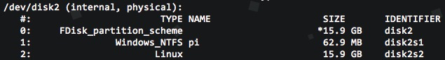</center>

The identifier you want is the SD card reader disk (not the SD card itself) -- remember this one. It should look like `disk2`, where the "2" can be any number.<br />

##### <b>Unmount the SD card</b>
You'll be using the identifier from the last step.<br />
Type
```
  diskutil unmountDisk /dev/diskX
```
into the terminal, where `X` is the number in your identifier. This will result in something like the below:
<center></center>

##### Copy the image onto the SD card.<br />
To do this, you're going to run
```
 sudo dd bs=5m if=RASBIAN_IMAGE_FILE.IMG of=/dev/rdiskX
 ```
`X` is that same identifier number and `RASBIAN_IMG_FILE.IMG` is the path to your *-rasbian-jessie.img file relative to your current working directory. So, for example, if I'm running all my commands from a directory other than where the image file is located, and my image file is in downloads, then my path would look like this: `~/Downloads/2016-03-18-rasbian-jessie.img`.

<center></center>

Notice this will ask you for your admin password. It's going to take a little while, so be patient. 

<b><u>Note:</u></b><br />
If this fails, try `disk` instead of `rdisk`.

Upon a successful copy, the terminal will spit out something like the following:

<center>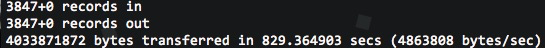</center>

Fantastic! 👍 Now we get to actually use the Pi. Woohoo!

#### Digging Into Some Pi
Okay, right, yes. Eject the SD card, take it out of the reader slot, it's time to give some attention to your cute Pi

##### Hookin' It Up
Put the SD card into the Pi:
<center>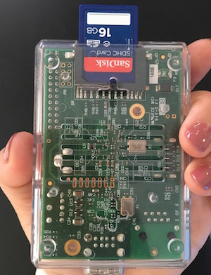</center>

Then plug in an ethernet cable as well as the micro-USB power supply:
<center>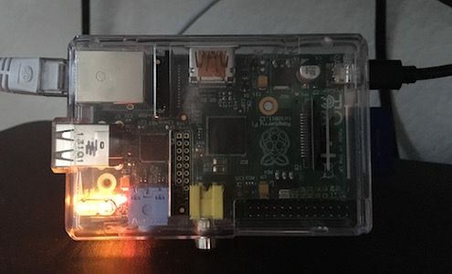</center>

#### SSH Into That Pi
[SSH](httpn://en.wikipedia.org/wiki/Secure_Shell), or Secure Shell, is a way for you to access a remote computer through a session in the terminal. So in this terminal session, you would be able to send commands to the remote computer as if you were physically on it. This is how we'll be setting things up without having the Pi connected to its own set of monitor/keyboard/mouse. This is a great skill to have -- have fun with it!

##### Get Pi's Digits
In order to SSH into the Pi, you'll need to obtain its [IP address](https://en.wikipedia.org/wiki/IP_address). There's a couple ways to get it:

Open a new tab in your terminal (`cmd + t`) and type in the command below: 
```
  arp -a
```
[ARP](https://en.wikipedia.org/wiki/Address_Resolution_Protocol), or Address Resolution Protocol, will allow you to get a list of all your devices and their respective IP addresses on the network you're on. You should see one called <b class="info-highlight">raspberripi</b> -- its IP address will be in parentheses next to it (in the image below, the IP address for the Pi is where the yellow block is).

<center>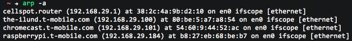</center>

Another, less exciting way, is to Use an iPhone/iPad app called [Fing](https://itunes.apple.com/us/app/fing-network-scanner/id430921107?mt=8&uo=8&at=11ld4k). Make sure your iOS device and the Pi are on the same network, as the app scans the network for all devices on your local network. 

##### Conversate With Pi
Now that you have your IP address, you can SSH into the Pi ✨

```
  ssh pi@YOUR_IP_ADDRESS
```
Don't forget to replace `YOUR_IP_ADDRESS`.<br />
Here's what this step should look like:

<center>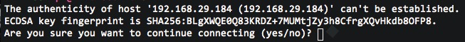</center>

Type `yes` and carry on. It will then ask you for the password, which is
```
  raspberry
```

<center>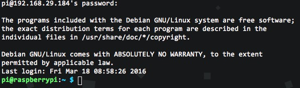</center>

CONGRATS! CHEERS! You've just set up your first Pi. Easy peasy. Now that you've got it going, we can get into setting up the Pi for Airplay! 🍻

### Some Config 🔧
Okay, you're SSH'd into the Pi. Let's make sure it's prepared for all the cool things you're going to put on it. Make sure from this point you're SSH'd into the Pi when running commands! You should be seeing `pi@raspberrypi:~$`, or something along the lines of that.

##### File System
You want the file system to take up the entire size of the SD card. Right now, the image is minimised -- this allowed for fast downloading and copying onto the SD card. So, we need to expand it.

To see the available and used disk space on your SD card, type 
```
  df
``` 

<center>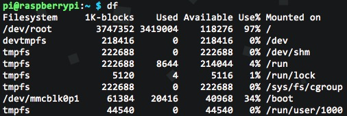</center>

Your summary should look something like this. Now, let's resize the partition so the Rasbian OS will take up the entire card. 

```
  sudo raspi-config
```
This should bring up a config menu like the one below:

<center>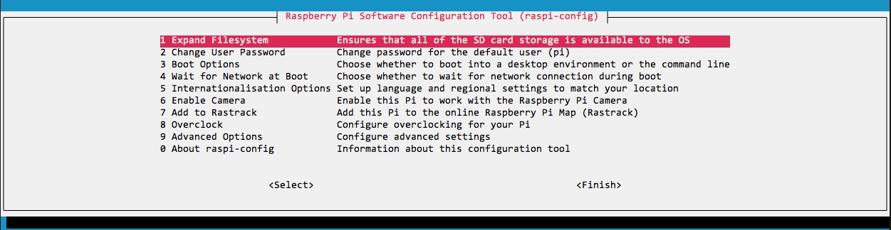</center>

When you see this, the first option, `Expand Filesystem` will be highlighted. Press `enter`.<br />
You'll see the regular terminal window again, then you'll see the following when the process is complete:

<center>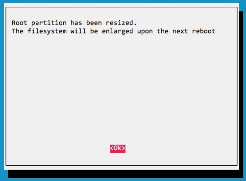</center>

Press `enter` again to go back to the config menu.<br />
Once you're back to the main config menu, click the `right arrow key` twice to select `finish`, then hit `enter`. This will bring you back to the command line.

##### Toot & Reboot
You need to reboot the Pi now to apply the changes:
```
  sudo shutdown -r now
```
This should result in a confirmation message that your SSH connection was suspended.

<center>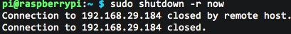</center>

Now that the connection is closed, you're going to SSH back into the Pi. So hit the <b class="info-highligh">up arrow key</b> a few times until you see the
```
  ssh pi@YOUR_IP_ADDRESS
```
command, and press `enter`. And remember, `YOUR_IP_ADDRESS` should be yours and the password is 
```
  raspberry
```

Awesome, now we're back to interacting with the Pi!

##### Update That Bizniz
We're going to do a little more prep before sinking into the Airplay stuff. First off, we need to make sure that all the Pi's packages are up to date. You can basically think of this like if you were to update your phone apps. You need to update them when you get the notification icon on the App Store to make sure you're getting the best overall experience with the app, right? Well, this is what the update for the Pi's packages does.

Run these commands, one after another:
```
  sudo apt-get update
  sudo apt-get upgrade
```
The `update` command should look something like this:
<center>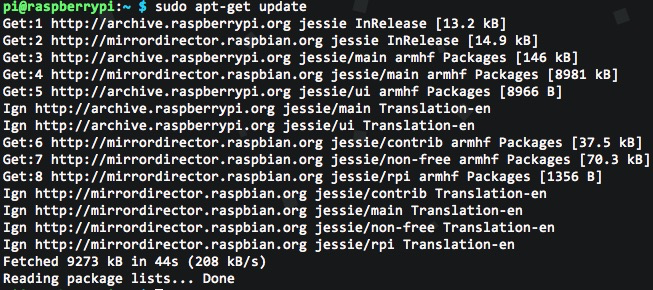</center>

The `upgrade` command will ask you if you're sure about making changes (upgrades) the the packages it lists.<br />
Type `Y` and let it proceed.<br />
Make sure it's a capital 'Y', not a lowercase 'y'. The upgrade command will look something like the following, and you'll want to give it a little time -- there may be quite a few upgrades.
<center>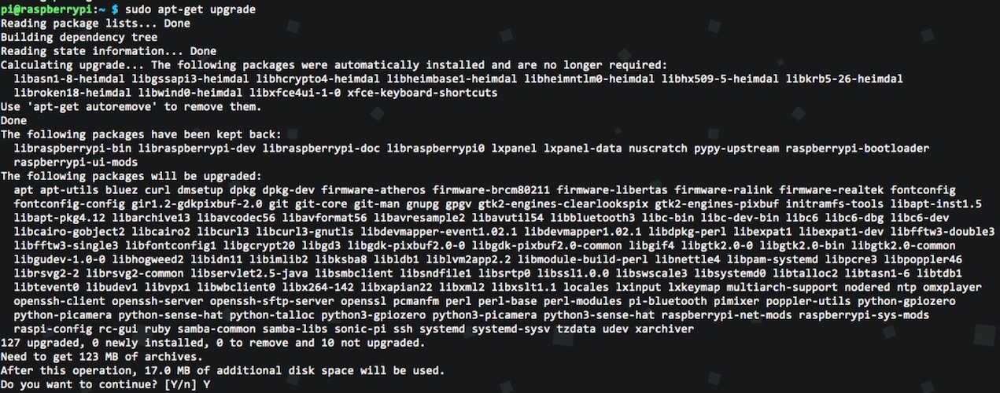</center>

For a little background, the `apt-get` tool in Rasbian is what handles the updates. It's an APT (Advanced Packaging Tool) commandline tool. You can read more about it [here](http://wiki.debian.org/Apt) if your curiosity is tickled. 

The first `update` command will do just that -- update the packages and their versions. The following `upgrade` command will take the information from update, compare that to new information available on each package, and upgrade the package if there's one available. 

You can think of it like this. Say you've baked a batch of cupcakes. At this point, each cupcake in the baking pan is the same. Now, if you took one of those and decorated it with frosting and sprinkles, that's an update to the cupake. An upgrade would be taking the cupcake batter and making a cake with it -- it's like cupcake 2.0. 

And that's it folks, easy as Pi 😉 If you're itching to get your hands dirty with more Pi shenanigans, try turning it into an AirPlay receiver! I've written up a step-by-step guide [here](../17/let-your-pi-sing.html).
