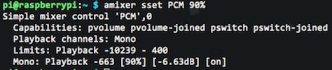

<p class="short-summary">A guide to creating an Airplay receiver with the Pi, so anyone with an iOS device or computer with iTunes installed can play you some sweet tunes.</p>
<!--more-->

Do you love music, convenience, and not having to put down your smartphone? If you're technically apt as well, then here's a little DIY to turn your Raspberry Pi into an Airplay receiver. You can hook it up to your favourite speaker and let the good times begin! As for myself, I've got mine plugged into the [Bose 10 Series II](http://worldwide.bose.com/productsupport/en_us/web/solo_10_series_ii/page.html) sound system -- it's 💎.

I know, if you Google how to make one of these, basically everyone and their mother have at some point written a tutorial -- so begs the question, why am I creating another one? Well, I've found that I've had to use several different sources to make the one work. Thus, I should share an updated tutorial. I know, I know, I'm so kind. 😂 Alright, so let's get to the good stuff!

### Things You Need
* • A configured [Raspberry Pi](../15/piece-of-raspberry-pi.html)</li>
* • 3.5mm stereo audio cable (this is so you can connect the Pi to your stereo)</li>
* • Stereo/Speakers</li>
* • iOS device or computer with iTunes installed</li>

### Airplay For Your Earholes
Finally, what you've been waiting for!

#### Configure The Audio Port
By default, the Pi's audio comes from the HDMI port. So unless you plan to have it plugged into a TV or somethang, you'll want the audio to come from the mini audio jack -- this way, you can hook it up to yo badass sound system 🔊

Alright then. Run the following command:
```
  sudo amixer cset numid=3 1
```

When you do this, you should see the following output:
<center></center>

What `amixer` does is allow you to modify the sound card's options. What we did with that command was set the 3rd soundcard element to 1. This triggers the analog output.

#### Some Installation Required
There are some pre-reqs to install. This is for something called [Shairport](http://arstechnica.com/apple/2011/04/shairport-emulates-airport-express-to-receive-airplay-streams/), which basically allows you to do what AirPort express does. This is what's going to allow your iOS device (iPhone, iPad, etc) to send music via Airplay to your Raspberry Pi so it plays through your speakers.

So paste the following into your terminal and run it (it'll eventually ask you if you're sure you want to proceed; when it does type `Y` and hit `enter`):
```
  sudo apt-get install git libao-dev libssl-dev libcrypt-openssl-rsa-perl libio-socket-inet6-perl libwww-perl avahi-utils libmodule-build-perl
```

It should look like this:
<center></center>

Basically, this is showing you what it's going to install -- the libraries you specified and their pre-requisites, if any.

Does the command look kind of familiar? That's because it's like the command we ran earlier to update the Pi.<br />
`sudo` says, "Run the command as an admin, yo!"<br />
`apt-get` as you remember, is the package manager.<br />
`install` is the command telling `apt-get` what to do; in this case it's to install what follows.
`git libao-dev libssl-dev libcrypt-openssl-rsa-perl libio-socket-inet6-perl libwww-perl avahi-utils libmodule-build-perl` are the libraries we're installing. 

#### It's Just Protocol
The next thing we need is Perl Net-SDP. This is going to allow the Pi to communicate with Airplay using the [SDP Protocol](https://en.wikipedia.org/wiki/Session_Description_Protocol), which Airplay has been using since iOS 6 (we're on 10 now). 

So let's do this. Just a friendly reminder, you should still be doing all these commands in your Pi SSH session! 

```
  git clone https://github.com/njh/perl-net-sdp.git perl-net-sdp
```

This is why we installed git previously. In this step, we're cloning a copy of this repo onto the Pi. You should see the following output:
<center></center>

Now we want to compile and install the Perl Net-SDP components into their proper places. Run the commands below, one at a time! 
```
  cd perl-net-sdp
  perl Build.PL
  sudo ./Build
  sudo ./Build test
  sudo ./Build install
  cd ..
```

Note, if you get any warning messages that look like the following, it's just about setting your locale and it won't interfere with any of your commands working properly:
<center></center>

Don't even trip, dawg.

#### Set To Receive
We're at that point where we're actually going to set up the receiver, huzzah! Congratulations for bearing with me and getting this far. 

Okay, so the following commands you'll run them one at a time, but of course.
```
  git clone https://github.com/hendrikw82/shairport.git
  cd shairport
  make
```

So what do these do?<br />
The first makes a clone of the Shairport repository on the Pi.<br />
The second, you're just changing directories into the repo you just cloned.<br />
The third, you're building the software.

Cool! You should see something like this:
<center></center>

With all that hard work, now you get to start the Shairport script and <u>name your receiver</u>. Basically, this is the alias you'll see on your iOS device. Choose wisely, friends.
```
  ./shairport.pl -a RECEIVER_NAME
```

Replace `RECEIVER_NAME` with the name you want to give your receiver.<br />
For mine, I did `./shairport.pl -a AirPi`.<br />
The `-a` command is saying "Hey, name my receiver whatever word comes after me."

So if you see something like the following, you're 👌
<center></center>

Notice the `@AirPi` -- it should show the receiver name you've provided. 

Let's discover the spoils of your labour! 🎉

#### A Little Note On iOS 10
Before we really check things out to see if everything's gone smoothly, I want to make a note for the non-savages who've upgraded to iOS 10 😜 I promise this is relevant. 

It seems our friends at Apple are hard at work making sure we buy more of their products. If you look at your control center (you know, that thing that slides up) you'll see that there's only the default option for "AirPlay Mirroring" and it'll only work if you have an Apple TV. Before iOS 10, you would be able to select devices that were AirPlay-AirPort express compatible -- to do this now, you'll have to `swipe left` to get to the screen you want. Let me show you what I mean:

<center>
  
  
</center>

The left shows the default "AirPlay Mirroring" and the right is what shows when you swipe left. That second screen is where you'll see what song you're playing (if you are), whether it's from the Apple Music app or Spotify, or what have you. Here's an image of what the control center looks like now when you're playing music and you've selected to stream it to your Pi (hint: it's always going to be on the 2nd page of the control center):
<center></center>

You'll also be able to select your Pi from the music apps themselves! Take a gander:
<center>
  
  
</center>

#### Check It Out!
The moment of truth folks. Whip out your iOS device, open up a music player, and see if your Pi is an available device! It's also important to note that you should make sure the Pi and your device are on the same wireless network, or it won't work. 

Did it work? Yes? Fantastic!<br />
❤️

As cool as it is, it would be kind of annoying if you had to SSH into the Pi and run that Shairport command from above everytime you wanted to use this, right? Hell yea. So let's fix that and make sure Shairpoint is running in the background of the Pi at all times and starts up at startup if you ever have to reboot the Pi. 

#### The Friendly Daemon
We're going to "Daemon-ize" Shairport, and no, I don't mean what left- and right-wing political groups do to each other. If you're not familiar with [daemons](https://en.wikipedia.org/wiki/Daemon_(computing)), they're computer programmes which run in the background and don't require a user to be explicitly controlling them. With that being said, we're going to make Shairport a daemon.

😈

Check: make sure you're SSH'd into the Pi!<br />
It can sometimes time out if you're inactive for too long.<br />
Or hit `ctrl + c` to suspend Shairport if you're still running it from the last command.

Let's run the following, one at a time:
```
  cd shairport
  sudo make install
  sudo cp shairport.init.sample /etc/init.d/shairport
```
These commands will take you to the shairport directory (if you're not already there -- because if you are, that first command doesn't apply to you), create the daemon directory, `make install`, and then copy a sample init file to the directory you just made. 

<center></center>

The next set of commands are as follows:
```
  cd /etc/init.d
  sudo chmod a+x shairport
  sudo update-rc.d shairport defaults
```
This is saying, "hey, go into the daemon directory `/etc/init.d`, change its permissions `chmod a+x` and "install" what's instructed in the Shairport init file with the default options -- `defaults`.

<center></center>

Now run this command:
```
  sudo vi shairport
```
This is going to open up the vi text editor in the terminal. Go down to what looks like this:
```
  DAEMON_ARGS="-w $PIDFILE"
```

<center></center>

If you're not familiar with vim/vi, follow these steps to get to the line, type one line at a time:
```
  /DAE [enter]
  n
  $
  i
  [space] -a RECEIVER_NAME
  [esc]
  :wq [enter]
```

`/DAE [enter]` will take you to the first instance of "DAE".<br />
`n` says, "Go to the next instance of my search term DAE".<br />
`$`, or `shift + 4`, takes you to the end of the line.<br />
`i` will put you in "insert mode", starting from behind the character you're on when going into this mode.<br />
`[space] -a RECEIVER_NAME` you're adding a default name to the DAEMON_ARGS option.<br />
`[esc]` will take you out of "insert mode".<br />
`:wq [enter]` tells vi to "write" the file and "quit" out to the terminal.<br />

So now, your line should look something like this:

```
  DAEMON_ARGS="-w $PIDFILE -a AirPi"
```

<center></center>

where `AirPi` is replaced with whatever you named the receiver. 

V cool. What you're doing here is setting your default AirPlay receiver name. Now, anytime you boot up the Pi, this Shairport executable file will also start. 

Remember, `RECEIVER_NAME` is what you were calling your AirPlay receiver. Mine was `AirPi`. 

### <br /><center></center>
You've done it! Pats on the back for finishing the AirPlay receiver project like a champ 👏

At this point, go ahead and stream something to the Pi and make sure everything's good to go! You may notice that the sound is a bit low. If that's the case read this next session on changing some settings for better audio output.

### Volumise
Can't hear your tunes? Let's set the volume as a percentage (although it can also be a dB gain or exact hardware value, and if interested can read more about [here](https://linux.die.net/man/1/amixer)) through amixer. [Amixer](https://linux.die.net/man/1/amixer) is a command-line mixer for soundcard drivers in Linux-based systems, like your Pi. Your Pi has the ASLA soundcard driver. You remember amixer from before, right? 😉

We know amixer is on the Pi because we've used an amixer command before. But if you want to do a sanity check and make sure I'm not lying to you, go back to your root level, `cd ~`, in the terminal, making sure you're SSH'd into the Pi, and type this command:
```
  which amixer
```
That should spit out the following:
<center></center>

See that? Yes? Cool. 

Now, stream your favourite song to your new AirPlay receiver so you can witness real-time sound checking as you set the volume percentage to your liking. If, for some reason, you don't see your Pi appearing as an AirPlay option, just reboot the Pi like so:
```
  sudo shutdown -r now
```

Got a song going? Fab. Love. 

Do the following command:
```
  amixer sset PCM PERCENT%
```
Needless to say, you'll want to change `PERCENT` to a number, leaving the `%` there. You need the `%`. For me, I set mine to `90%`. I found going all the way up to 100% gives some not-too-favourable results. 

<center></center>

Play around with the percentage until you find a sweet spot for you. Once you've done that, you'll want to save this setting lest you want to set this every time you start up the Pi. Blegh, who wants to do that, amiright? Let's save this badboy:
```
  sudo alsactl store
```

This will store the volume setting. 

Woo! You're done configuring your Pi for excellent AirPlay capabilities! Let the good times roll 🎉

Now, unless you want to keep the ethernet cable plugged into your Pi at all times, you'll want to get your Wi-Pi set up. So if you're going to be joining me in this part, go to the tutorial on [setting up Wi-Fi](../wifi-for-your-pi.html)!
