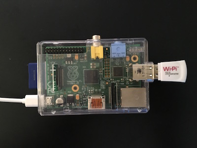
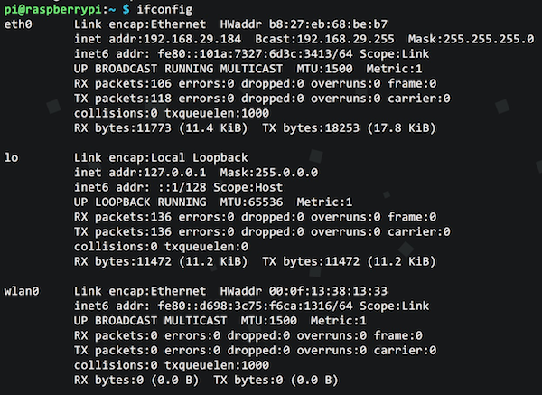
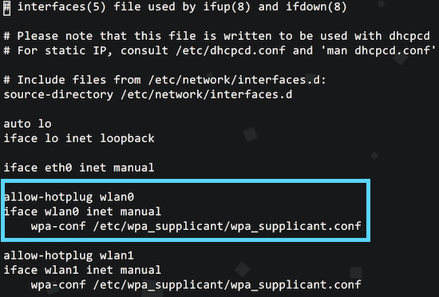
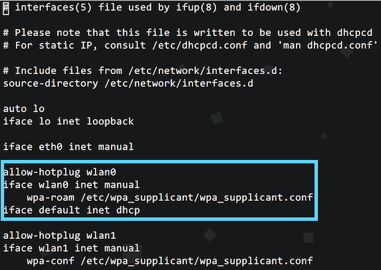
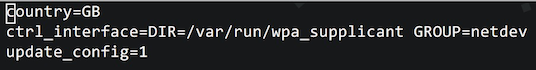
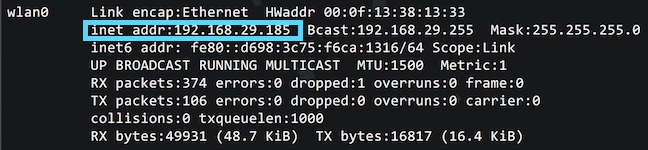
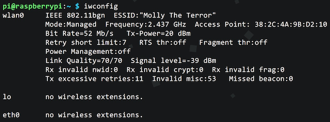

<p class="short-summary">A fine tutorial for configuring a wireless adapter so you can have WiFi on your Pi.</p>
<!--more-->

Let's get y'all set up with WiFi on your Pi so you're not a savage 🙅

### The Pi Necessities
* • A configured [Raspberry Pi](../15/piece-of-raspberry-pi.html)</li>
* • WiFi USB Adapter (I use the [Wi-Pi](http://www.newark.com/element14/wipi/wlan-module-for-the-raspberry/dp/07W8938), but you can see other compatible ones [here](http://elinux.org/RPi_USB_Wi-Fi_Adapters))</li>

### Wi-Pi Power Activate
Ok, so if you're SSH'd into the Pi, shut it down. Shut. It. Down. 

<center></center>

Okay, now plug in your cute Wi-Pi (or whatever compatible USB WiFi adapter dongle you have). You should have something that looks a little like this now:

<center></center>

We should basically be #twinning.

Sweet, so let's start the Pi up again! 
```
  ssh pi@YOUR_IP_ADDRESS
```
And of course, remember to replace `YOUR_IP_ADDRESS` with just that. 

Now, let's see if the Pi's detected the dongle. Type the following:
```
  ifconfig
```

This should show something like this:
<center></center>

If you have `wlan0` in your output, then that means it's detected the WiFi dongle.<br />
`eth0` indicates the built-in wired ethernet port, `lo` is the loop back device, and of course `wlan0` is the wireless adapter. 

##### Home Stretch
Since that's good to go, it's time for some config fun!

The Pi should come pre-installed with all the necessary packages for us to configure the WiFi capability. If not at any point, the commands are not working properly, run this:
```
  sudo apt-get install wpasupplicant wireless-tools
```

Alright, so let's start running some commands to get this ish working! First we need to configure some things in the general network and WiFi settings. 
```
  sudo vi /etc/network/interfaces
```

We're going to be working in the Vi text editor again to configure the general network settings, which live in `/etc/network/interfaces`. When you see the file open on your screen, it should resemble this:
<center></center>

You want to look at the `wlan0` part. Make sure it looks like the following:
```
  allow-hotplug wlan0
  iface wlan0 inet manual
  wpa-roam /etc/wpa_supplicant/wpa_supplicant.conf
  iface default inet dhcp
```

Attention to detail is gonna be your best friend.<br />
Make your wlan0 part looks just like that -- make any changes necessary so it now mirrors this:
<center></center>

Don't forget to `:wq` 😀

Time to peek at the available wireless networks:
```
  sudo iwlist wlan0 scan
```

Odds are, that's gonna list out a lot of crap. We can use `grep` to filter through all the noise and get what we want:
```
  sudo iwlist wlan0 scan | grep "ESSID"
```
If you want to read more about `grep` and all the wonders it can do for you, go [here](https://www.gnu.org/software/grep/manual/grep.html).

What we're doing here is getting the output of the last command `sudo iwlist wlan0 scan`, piping it through grep and returning only what matches the query we specified after `grep`, which in this case is `ESSID`.

This will output a list just showing the names of wireless networks that are available to you. Find the one you'll be using, which I assume is your own network. Now, with that information, let's modify the `wpa_supplicant.conf` file and add our network authentication info so your Pi will know what to connect to. 
```
  sudo vi /etc/wpa_supplicant/wpa_supplicant.conf
```

That will open up the file in Vi again, and you'll see this:
<center></center>

Go a couple lines down from the end of the file and add one of the following:

If your router's configured with WPA for encryption:
```
  network={
    ssid="YOUR_NETWORK_NAME"
    psk="YOUR_NETWORK_PASSWORD"
    key_mgmt=WPA-PSK
  }
```

Else if your router's configured with WEP for encryption, then use this:
```
  network={
    ssid="YOUR_NETWORK_NAME"
    wep_key0="YOUR_NETWORK_PASSWORD"
    key_mgmt=NONE
  }
```

You can also add the following configuration fields:
`proto`: This is the protocol type and it can be either `RSN` (WP2) or `WPA` (WPA1)<br />
`pairwise`: This can be `CCMP` (WP2) or `TKIP` (WPA1)<br />
`auth_alg`: For authentication algorithm; this can be `OPEN` (WP2 and WPA1), `SHARED`, or `LEAP`.

Once you've got what you want in the file, write and quit - `:wq`. 

Fantastic! Now, let's reboot the Pi to see if we're successful. 
```
  sudo shutdown -r now
```

Time of truth, people. SSH back into the Pi when you see the lights all come back on on the Pi.
```
  ssh pi@YOUR_IP_ADDRESS
```

Now, let's check to see if `wlan0` has acquired an IP address -- if so, it's a success!
```
  ifconfig
```

You should see that `wlan0` now has an IP address:
<center></center>

Let's also see which network your wireless adapter is using:
```
  iwconfig
```

If all has gone well, you should see something like this:
<center></center>

You should be able to disconnect the ethernet cable from your Pi now.

Et voile! You've done it! 👯 
